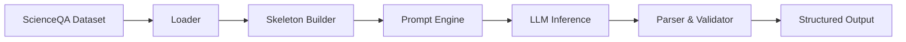

# P-GALM Framework Report

## 1. Executive Summary

**P-GALM (Probabilistic Graph-Augmented Language Model)** is a neuro-symbolic framework that integrates the reasoning capabilities of Large Language Models (LLMs) with the structured interpretability of Probabilistic Graphical Models (PGMs). 

This system specifically targets the **ScienceQA** dataset, transforming standard Multiple Choice Question (MCQ) answering into a structured inference process. Instead of simply predicting an answer token, the system constructs a Bayesian network where the final answer depends on a series of intermediate **latent variables** (e.g., relevance, knowledge quality, reasoning clarity).

The core innovation is the **Verbalized PGM (vPGM)** approach: rather than learning numerical Conditional Probability Tables (CPTs) from data, the system uses an LLM to "verbalize" the inference, generating both the probability distributions and textual justifications for each node in the graph at runtime.

## 2. System Architecture

The P-GALM pipeline consists of four main stages:

### 2.1. Data Loading & Skeletonization
-   **Module**: `scienceqa_vpgm_loader.py`
-   **Function**: Ingests raw ScienceQA examples (which may contain text, images, lectures, and hints).
-   **Output**: A "Skeleton" JSON object. This object represents the observed nodes ($X$) of the PGM but leaves the latent nodes ($Z$) and answer node ($Y$) empty.
-   **Handling Missing Data**: The system generates synthetic IDs (`idx_N`) for dataset items lacking intrinsic identifiers to ensure traceability.

### 2.2. Prompt Engineering
-   **Module**: `build_vpgm_llm_prompt.py`
-   **Function**: Converts the JSON skeleton and the PGM template into a natural language prompt.
-   **Mechanism**: It injects the observed data into the prompt and appends specific "verbal instructions" for each latent variable. These instructions act as the "functions" that define the dependencies between nodes.

### 2.3. LLM Inference Client
-   **Module**: `vpgm_llm_client.py`
-   **Function**: Interfaces with the LLM (e.g., GPT-4).
-   **Role**: The LLM acts as the **Inference Engine**. It does not just "answer the question"; it executes the graph's logic step-by-step.
-   **Validation**: The client strictly parses the LLM's output, ensuring it adheres to the JSON schema and that all probability distributions sum to 1.0 (within tolerance).

### 2.4. User Interface
-   **Module**: `server.py` (FastAPI) + `web_ui/`
-   **Function**: Provides an interactive explorer for the dataset.
-   **Features**: Allows users to search questions, visualize the observed data, trigger inference, and inspect the resulting posterior distributions and justifications.

## 3. The vPGM Methodology

Traditional PGMs require defining the graph structure and learning numerical parameters (CPTs) from large datasets. P-GALM retains the **Graph Structure** but replaces the fixed CPTs with **LLM Generation**.

### 3.1. The Graph Structure (`scienceqa_vpgm_4latent_generic`)

The system uses a specific Bayesian network designed for robust QA reasoning.

**Nodes:**
*   **$X$ (Observed)**: Question, Options, Context, Lecture, Image Caption.
*   **$Z$ (Latent)**: Intermediate reasoning steps.
*   **$Y$ (Answer)**: The final probability distribution over the options.

**Latent Variables ($Z_1$ - $Z_4$):**

1.  **$Z_1$: Relevance Assessment**
    *   *Dependencies*: $X$ (All inputs)
    *   *Purpose*: Filters noise. Determines how relevant the provided context/lecture is to the specific question asked.
    *   *States*: `[very_low, low, medium, high, very_high]`

2.  **$Z_2$: Knowledge Quality**
    *   *Dependencies*: $X$ (Context/Lecture)
    *   *Purpose*: Evaluates the reliability and completeness of the information sources. Is the "fact" actually true and sufficient?
    *   *States*: `[very_low, low, medium, high, very_high]`

3.  **$Z_3$: Question Clarity**
    *   *Dependencies*: $X$ (Question), $Z_1$ (Relevance), $Z_2$ (Quality)
    *   *Purpose*: Checks if the question is well-posed given the relevant and high-quality knowledge. Detects ambiguity.
    *   *States*: `[very_low, low, medium, high, very_high]`

4.  **$Z_4$: Logical Reasoning**
    *   *Dependencies*: $X$ (Question/Options), $Z_2$ (Quality), $Z_3$ (Clarity)
    *   *Purpose*: The core deductive step. Performs the reasoning to link the question to the options, conditioned on having clear inputs and good knowledge.
    *   *States*: `[very_low, low, medium, high, very_high]`

### 3.2. Verbalized Inference

In a standard PGM, $P(Z_3 | Z_1, Z_2)$ is a lookup table. In P-GALM, it is a text generation task:

> "Using the relevance assessment ($Z_1$) and knowledge quality ($Z_2$), evaluate how clearly the question is posed... Output probabilities..."

The LLM outputs:
1.  **Justification**: A natural language explanation of the conditional probability.
2.  **State Probabilities**: A dictionary mapping states to float values (e.g., `{"high": 0.8, "medium": 0.2}`).

This makes the model **interpretable by design**. If the model gets an answer wrong, we can inspect the graph:
*   Did it think the irrelevant context was relevant ($Z_1$ error)?
*   Did it hallucinate knowledge quality ($Z_2$ error)?
*   Did it fail at the logical step ($Z_4$ error)?

## 4. Technical Implementation Details

### 4.1. Data Handling
The system uses the Hugging Face `datasets` library to stream the ScienceQA dataset. Since the dataset lacks intrinsic IDs in some versions, the system implements a robust **synthetic ID generation** strategy based on dataset indices, ensuring consistent addressing of examples across the API and UI.

### 4.2. Robustness & Sanitization
Special care is taken to handle multimodal data. The backend sanitizes inputs (e.g., removing raw PIL Image objects) before serialization to prevent API crashes. The frontend is designed to gracefully handle missing optional fields (like lectures or hints).

### 4.3. Extensibility
The framework is template-driven (`prompt_template.json`). New graph structures (e.g., a 2-variable simplified model or a domain-specific medical model) can be added simply by defining a new template in the JSON file, without changing the core Python code.
